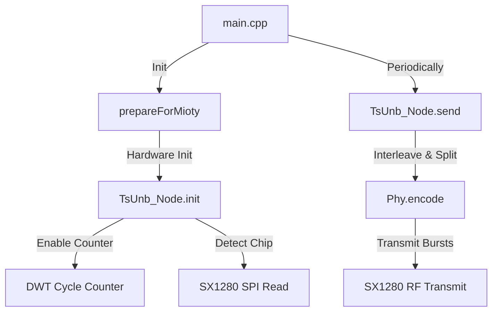

# Mioty (TS-UNB) Transmitter Validation & Testing Guide

This document describes how the Mioty transmitter firmware works, how it interacts with the hardware, and how to verify its RF output using a spectrum analyzer.

---

## 1. System & Firmware Architecture

The firmware is designed for an **STM32F103CBUx** microcontroller interfacing with a Semtech **SX1280** (2.4 GHz) radio module. It implements the ETSI TS 103 357 standard (Telegram Splitting Ultra Narrowband - TS-UNB / Mioty).

### Core Code Components
1. **[main.cpp](file:///c:/Users_windows/Chandu%20B%20Reddy/Projects/LOcalee/Sx-1280-bring%20up%20local/5_ble_mioty_ble_tx_ble_working_Mioty/Core/Src/main.cpp)**
   * Manages the startup LED sequence, initializes the hardware (including hard resetting the SX1280 via `LORA_NRST`), configures the 8 MHz HSE clock, and loops every 5 seconds to send a payload.
2. **[STM32TsUnb.h](file:///c:/Users_windows/Chandu%20B%20Reddy/Projects/LOcalee/Sx-1280-bring%20up%20local/5_ble_mioty_ble_tx_ble_working_Mioty/Core/Inc/STM32TsUnb.h)**
   * Implements the hardware abstraction layer (HAL) for the TS-UNB library on STM32.
   * Utilizes the **DWT (Data Watchpoint and Trace)** cycle counter for high-precision wait cycles to align the transmitter symbols on exact sub-microsecond boundaries.
3. **[Trx/SX1280.h](file:///c:/Users_windows/Chandu%20B%20Reddy/Projects/LOcalee/Sx-1280-bring%20up%20local/5_ble_mioty_ble_tx_ble_working_Mioty/Core/Inc/Trx/SX1280.h)**
   * Configures the RF module, handles power settings, sets the carrier frequency register, and drives the continuous-wave (CW) frequency shifts.
4. **[TsUnb/SimpleNode.h](file:///c:/Users_windows/Chandu%20B%20Reddy/Projects/LOcalee/Sx-1280-bring%20up%20local/5_ble_mioty_ble_tx_ble_working_Mioty/Core/Inc/TsUnb/SimpleNode.h)**
   * Encapsulates the user payload into a MAC packet, performs physical-layer encoding, interleaves data, and sequences the radio bursts.

---

## 2. Physical & RF Mechanics (How Mioty Transmits)

Mioty does not transmit the entire packet in one continuous block. Instead, it uses **Telegram Splitting**:
* The payload is split into **24 small radio bursts** (sub-packets).
* Each burst contains **36 symbols** (24 data symbols, 12 midamble symbols) plus 2 head/tail ramp symbols.
* The bursts are sent on **different frequencies** (frequency hopping) with **varying time gaps** (time hopping) determined by a pseudo-random TSMA pattern.
* Transmission of the entire set of 24 bursts takes **approx. 2 to 4 seconds**.

> [!IMPORTANT]
> Because of this time-hopped design, the transmission is **not a single continuous signal**, but rather a series of very short, fast pulses across the 2.4 GHz band.

---

## 3. Visual Checks (LED Behavior)

The board's LED (on `PC13`, configured as active-high) provides visual diagnostic feedback:

* **Stage 1: Boot & Reset (3 short blinks)**
  * Happens immediately upon reset. Confirms the STM32 has booted and successfully toggled the `LORA_NRST` pin to reset the SX1280.
* **Stage 2: Pause (2 seconds OFF)**
  * The LED remains OFF during this pause.
* **Stage 3: Ready (1 long blink - 500ms)**
  * Confirms that the Mioty library has finished initializing, has verified SPI communication, and is about to start the main loop.
* **Stage 4: Heartbeat (3 short blinks every 5 seconds)**
  * Toggles right before a transmission starts, confirming the loop is running.

> [!WARNING]
> If the LED **flashes rapidly (150ms intervals) forever** right after the pause, it means the SPI connection to the SX1280 has failed (the chip did not respond with `0x40` when reading register `0xc0`). Check your SPI wiring.

---

## 4. Live Expression Debug Variables

If you run the board with a debugger connected, add these to your **Live Expressions** view:

| Variable | Expected Value / Behavior | Purpose |
| :--- | :--- | :--- |
| `DWT->CYCCNT` | Incrementing rapidly | Verifies that the cycle counter is active (required for timing). |
| `packet_counter` | Increments by 1 every 5 seconds | Verifies that the main loop is successfully calling `send()`. |
| `RCC->CSR` | Check upper bits (typically `0x0C000000` or similar) | Explains the reset cause (e.g. Pin Reset vs. Power-On Reset). |

---

## 5. Spectrum Analyzer Verification Steps

Use a spectrum analyzer to capture the Telegram Splitting frequency hops.

### Config Settings
1. **Center Frequency:** `2450 MHz` (2.45 GHz, mid-band ISM)
2. **Span:** `100 MHz` to `200 MHz`
3. **RBW (Resolution Bandwidth):** `100 kHz` or lower
4. **VBW (Video Bandwidth):** `Auto` or `300 kHz`
5. **Trace Mode:** **Max Hold** (Crucial to capture all hopping pulses)

### What to Look For
1. Start a **Max Hold** trace.
2. Watch the LED. When the **3 short heartbeat blinks** occur, look at the spectrum analyzer screen.
3. Over the next **2 to 4 seconds**, you should see narrow, sharp spikes appearing one by one at different frequencies across the span:

[Spectrum Analyzer Hopping Signal (Image)](file:///C:/Users/chand/.gemini/antigravity-ide/brain/7e45d4fe-6cb9-490d-88e3-bf2ba829d5de/media__1782988749469.png)

4. Once the packet transmission completes, the signal output stops.
5. Exactly **5 seconds later**, the sequence repeats, generating new spikes in different pseudo-random channels.

---

## 6. Mioty Loop Cycle Timing Explanation

When `TX_INTERVAL_MS` is set to `5000` (5 seconds), you will notice that the actual cycle time between transmissions is approximately **10 to 11 seconds**. This is normal and correct, as the loop runtime is composed of three parts:

$$\text{Total Loop Time} = \text{LED Heartbeat (0.5s)} + \text{Mioty Transmission (5.5s)} + \text{Explicit Delay (5.0s)} \approx 11\text{ seconds}$$

### Timing Breakdown:
* **LED Heartbeat Blink (~0.5s):** 3 blinks (80ms on / 80ms off) right before the packet transmission.
* **Mioty Transmission airtime (~5.5s):** Mioty uses **Telegram Splitting**, sending 24 sub-packets (bursts) with pseudo-random time intervals between them. The standard requires the transmission sequence to spread over a ~5.5-second window to prevent collisions. Because `TsUnb_Node.send()` is a **blocking** function that busy-waits for exact symbol alignment, it takes ~5.5 seconds to return.
* **Explicit Wait Delay (5.0s):** The `HAL_Delay(5000)` configured in `main.cpp`.

---

## 7. Receiver Integration & Decoding Requirements

If you set up a Mioty-compliant receiver or gateway to decode this signal and read the payload, ensure the following configurations are matched:

### A. Credentials Configuration
The payload is encrypted at the MAC layer. The receiver must be provisioned with these exact details:
* **Device Address (EUI64):** `70:b3:d5:67:70:ff:01:70`
* **Encryption Key (AES-128 Network Key):** `53ADF802B197F2738D5DDDA577E1FA9C` (hexadecimal representation of `MAC_NETWORK_KEY`)

### B. PHY Profile Settings
* **Frequency Range:** `2.4 GHz` (centered around `2450 MHz`)
* **PHY Profile Mode:** **Lambda80** (Symbol rate multiplier: 48)

### C. Expected Decoded Data
Upon successful decryption and integrity verification, the gateway will output a **20-byte payload**:
* `payload[0..3]`: A 32-bit big-endian integer representing the incrementing `packet_counter`.
* `payload[4..19]`: Zero padding (`0x00`).
