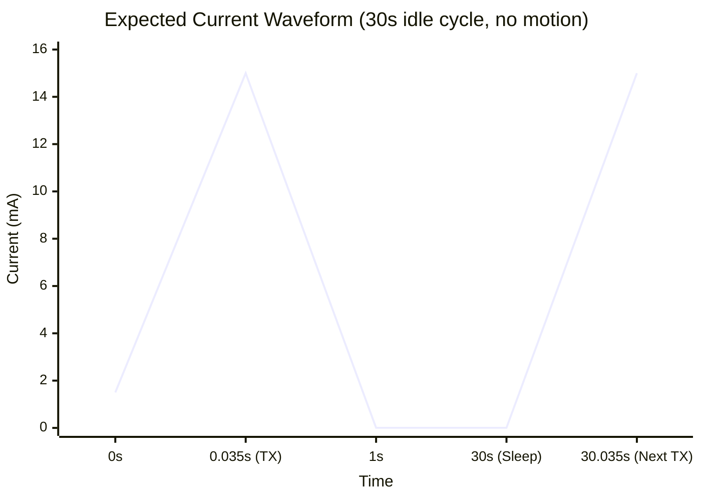

# Motion-Gated Scheduler Power Profiling & Joulemeter Setup Guide

This document outlines the procedure for measuring the power profile of `ble_single_shot_scheduler_test` using a Power Analyzer (Joulemeter) or bench power supply. The setup/wiring/analyzer-configuration sections are unchanged from `7_joulemeter_test` (same board, same CR2032-simulation methodology) — only the expected waveform differs, since this project's cycle is variable (2s/30s) rather than a fixed 10s, and it has no post-TX LED flash.

> [!IMPORTANT]
> This project has **no real mioty hardware** — mioty's "send" is a `HAL_Delay(~5.5s)` standing in for the real blocking TX time, not an actual radio transmission. A joulemeter trace will show ~5.5s of plain MCU-awake-idle current during that window, not an RF TX burst. That segment doesn't represent real mioty power draw.

> [!IMPORTANT]
> To get accurate idle current readings (~5 µA), you **must** comment out `HAL_DBGMCU_EnableDBGStopMode();` in `main.c` before flashing (search for it — its line number shifts as the file changes). Leaving this enabled keeps the STM32's debug block powered during Stop Mode, which will artificially inflate your idle current by hundreds of microamps.

---

## 1. Power Supply Settings (Simulating a CR2032)

A standard CR2032 lithium coin cell has a nominal voltage of 3.0V and relatively high internal resistance. To simulate this environment with a bench power supply or source-meter:

*   **Voltage (`V`)**: Set to **3.0V** (test down to 2.7V to simulate a dying battery).
*   **Current Limit (`I`)**: Set the compliance/limit to **50 mA**.
    * *Why?* A CR2032 has a low continuous discharge rating (usually ~3 mA), but it can supply short pulsed bursts of 15-20 mA. Setting your supply limit to 50 mA gives the board enough headroom to complete the ~15 mA TX burst without triggering overcurrent protection, while still protecting your board if a short circuit occurs.

---

## 2. Hardware Test Setup

### Option A: Analyzer as the Power Source (Recommended)
1. Set the Joulemeter output voltage to **3.0V**.
2. Connect **VOUT+** to the **3.3V / VCC** pin on the STM32 board, **GND** to **GND**.
3. **Disconnect the ST-Link** entirely (unplug 3.3V, GND, SWDIO, SWCLK) — a connected debugger back-powers the board and ruins the reading.

### Option B: Analyzer in Series with a Bench Supply
1. Set bench supply to **3.0V** and current limit to **50 mA**.
2. Bench Supply **GND** → board **GND**. Bench Supply **V+** → Joulemeter **IN+**. Joulemeter **OUT-** → board **3.3V/VCC**.
3. **Disconnect the ST-Link** entirely.

---

## 3. Power Analyzer (Joulemeter) Configuration

*   **Sampling Rate**: at least **1,000 Sps**; 10 kSps or higher to resolve the ~35 ms TX burst cleanly.
*   **Measurement Window**: size to whichever phase you're capturing — a minute or two to see several 2s active-cadence wakes, or several minutes for multiple 30s idle-cadence wakes.
*   **Current Range**: auto-ranging, or fixed to comfortably cover **5 µA to 20 mA**.

---

## 4. Expected Power Profile & Waveform

Unlike `7_joulemeter_test`'s fixed 10-second cycle, this project's cycle length depends on motion state — capture whichever phase you're interested in separately:

### Idle cadence (stationary, 30s BLE period)

### Active cadence (after a tilt, 2s BLE period)

Same shape, but the ~35ms/~15mA TX burst repeats every 2s instead of 30s.

### Simulated mioty send (every ~60s active / ~900s idle)

A ~5.5s segment of plain MCU-awake current (no RF activity — see the caveat above), then a clean return to the Stop-mode floor.

### Phase Breakdown

1.  **TX Burst (~35 ms)**: a sharp block of current around **~15 mA** — the SX1280 transmitting the real FMDN beacon on channels 37, 38, and 39. No LED flash follows it in this project (removed from the earlier fixed-cycle version, since the LED scheme here uses distinct blink-count events instead — see `README.md`).
2.  **Stop Mode Sleep**: current drops to the baseline floor, roughly **5 µA to 15 µA**, for the remainder of the 2s or 30s cycle.
3.  **Simulated mioty block (~5.5s, occasional)**: elevated MCU-active current with no RF component — flag this segment as a simulation artifact if you're recording numbers for comparison against `8_ble_mioty_tracker`'s or `9_Mag_ble_mioty_tracker`'s real mioty current.

> [!TIP]
> **Averaging**: drag a selection box across a whole number of BLE wake periods (e.g. exactly ten 2s cycles, or three 30s cycles) for a clean average of that cadence. Average the simulated mioty-block segment separately — don't fold it into a "total average power" number meant to represent a real tracker, since it isn't real radio current.
