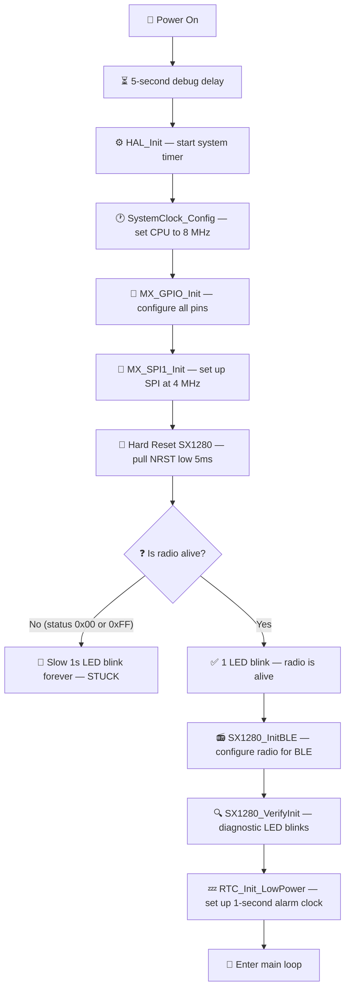
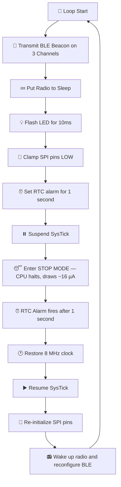

# How This BLE Beacon Code Works — A Complete Beginner's Guide

This document walks through the entire firmware from power-on to the repeating sleep cycle, explaining every step in plain English. No prior embedded systems knowledge is assumed.

---

## What Does This Project Do?

Imagine a tiny electronic lighthouse. Every 1 second, it wakes up, shouts "I'M HERE!" on Bluetooth to every smartphone nearby, flashes its LED once, and goes back to sleep. It does this over and over, running on a tiny coin-cell battery for weeks or months.

That is exactly what this firmware does. It turns a small circuit board (with an STM32 microcontroller and an SX1280 radio chip) into a **BLE iBeacon** — a wireless Bluetooth beacon that smartphones can detect to determine proximity and location.

---

## The Two Chips on the Board

### 1. The Brain — STM32F103 Microcontroller (MCU)
This is a tiny computer. It has:
* A **processor** (ARM Cortex-M3) that runs your C code.
* **Flash memory** (128 KB) — like the hard drive. Your program is stored here permanently, even when power is off.
* **RAM** (20 KB) — like the computer's short-term memory. Variables live here while the program is running.
* **GPIO pins** — General Purpose Input/Output pins. These are the physical metal legs of the chip that connect to LEDs, buttons, and other chips.
* **SPI peripheral** — a built-in hardware module for talking to other chips using a fast, synchronous 4-wire protocol.
* **RTC** — Real-Time Clock. A simple internal clock that can keep ticking even when the main processor is asleep.

### 2. The Radio — Semtech SX1280 Transceiver
This is the wireless radio chip. It handles all the complex RF (Radio Frequency) physics:
* Generating the 2.4 GHz radio signal (the same frequency band as your Wi-Fi and Bluetooth).
* Encoding and transmitting the BLE advertising packet through the antenna.
* The STM32 tells it *what* to transmit and *when*, but the SX1280 handles the actual radio transmission.

### How They Talk to Each Other — SPI
The STM32 and SX1280 communicate using **SPI (Serial Peripheral Interface)**. Think of it like a walkie-talkie with 4 wires:

| Wire | Name | Direction | Purpose |
|:-----|:-----|:----------|:--------|
| `PA5` | SCK | STM32 → SX1280 | Clock signal — like a metronome that synchronizes both chips |
| `PA7` | MOSI | STM32 → SX1280 | Master Out, Slave In — data flowing from the brain to the radio |
| `PA6` | MISO | SX1280 → STM32 | Master In, Slave Out — data flowing from the radio back to the brain |
| `PA4` | NSS | STM32 → SX1280 | Chip Select — pulled LOW to say "Hey radio, I'm talking to you!" |

Two additional signal wires:
| Wire | Name | Direction | Purpose |
|:-----|:-----|:----------|:--------|
| `PB15` | BUSY | SX1280 → STM32 | HIGH = "Wait, I'm still processing." LOW = "Ready for next command." |
| `PB0` | DIO1 | SX1280 → STM32 | Goes HIGH when the radio finishes transmitting a packet (TxDone signal). |

---

## The Complete Lifecycle — What Happens From Power-On

### Phase 1: Power-On Boot Sequence (Runs Once)

When you connect the battery or plug in the USB cable, the following sequence plays out:



#### Step-by-step:

**1. Debug Delay (5 seconds)**
```c
for (volatile uint32_t i = 0; i < 5000000; i++);
```
When you first flash (program) the chip, the debugger tool (ST-Link) needs a moment to reconnect. This empty counting loop wastes 5 seconds on purpose, giving the programmer tool time to grab onto the chip before the code does anything important. Without this, you could accidentally lock yourself out of reprogramming the chip.

**2. HAL_Init()**
Initializes the chip's internal housekeeping: sets up the system timer (SysTick) that ticks every 1 millisecond, resets all peripherals to a known state, and configures the interrupt system.

**3. SystemClock_Config()**
Sets the CPU's clock speed. Instead of running at full speed (72 MHz with PLL), we run directly off the external 8 MHz crystal. This is like downclocking your PC — it runs slower but uses dramatically less power (from ~30 mA down to ~2.5 mA).

**4. MX_GPIO_Init()**
Configures every physical pin on the chip:
* `PC13` (LED) → Output, so we can turn it on and off.
* `PA4` (NSS) and `PA3` (NRST) → Output, so we can control the radio's chip-select and reset lines.
* `PB0` (DIO1) and `PB15` (BUSY) → Input, so we can read signals coming from the radio.

**5. MX_SPI1_Init()**
Configures the SPI communication bus: Master mode, 4 MHz clock speed, 8-bit data size, and MSB-first byte order.

**6. Hard Reset the SX1280**
```c
HAL_GPIO_WritePin(LORA_NRST_GPIO_Port, LORA_NRST_Pin, GPIO_PIN_RESET); // Pull NRST LOW
HAL_Delay(5);                                                           // Hold for 5ms
HAL_GPIO_WritePin(LORA_NRST_GPIO_Port, LORA_NRST_Pin, GPIO_PIN_SET);   // Release HIGH
HAL_Delay(10);                                                          // Wait 10ms for boot
```
This is like holding the power button on a computer to force a restart. The radio chip resets all its internal registers to factory defaults.

**7. SPI Sanity Check**
```c
uint8_t status = SX1280_GetStatus();
if (status == 0x00 || status == 0xFF) { /* error: blink forever */ }
```
We ask the radio "what is your status?" via SPI. If the response is `0x00` (all zeros) or `0xFF` (all ones), the radio is either dead, not connected, or the SPI wiring is broken. The LED blinks slowly forever to signal this hardware failure. If we get a valid response, we blink the LED once to confirm the radio is alive.

**8. SX1280_InitBLE() — Configure the Radio for Bluetooth**
This function sends a series of SPI commands to tell the radio chip exactly how to behave:
* **Go to Standby mode** — the radio is powered on but not transmitting.
* **Set packet type to BLE** — tell it we want Bluetooth Low Energy, not LoRa or FLRC.
* **Set buffer addresses** — tell it where in its internal memory to store the packet data.
* **Set modulation parameters** — configure GFSK modulation at 1 Mbps (the standard BLE data rate).
* **Set TX power to 0 dBm** — set the transmission strength to 1 milliwatt (enough for ~10 meter range, very battery-friendly).
* **Write the BLE Access Address** — `0x8E89BED6`, which is the universal "key" that every BLE device listens for on advertising channels.
* **Write the CRC seed** — `0x555555`, used for error-checking in BLE packets.
* **Map TxDone interrupt to DIO1 pin** — so the radio physically raises a wire when it finishes transmitting.

**9. SX1280_VerifyInit() — Diagnostic LED Readback**
Reads back the registers we just wrote and blinks the LED to confirm they were stored correctly:
* **9 blinks** = Access Address register OK.
* **6 blinks** = CRC seed register OK.
* **3 blinks** = Radio is in Standby RC mode (correct).
* **1 blink** = Command status is idle (correct).

If you see `9, 6, 3, 1` blinks — the radio initialization is perfect.

**10. RTC_Init_LowPower() — Set Up the Alarm Clock**
Configures the Real-Time Clock to use the external 32.768 kHz watch crystal (LSE):
* Enables the crystal oscillator.
* Divides the 32,768 Hz frequency by 32,768 to get exactly **1 tick per second**.
* Configures the alarm interrupt line (EXTI Line 17) so that when the alarm fires, it wakes up the sleeping CPU.

---

### Phase 2: The Infinite Low-Power Loop (Repeats Forever)

After initialization, the code enters an infinite loop that repeats every ~1 second:



#### Step A: Transmit the BLE Beacon (`SX1280_SendBLEBeacon`)

This function transmits an **Apple iBeacon** advertising packet on all 3 BLE advertising channels. BLE specifies that advertising happens on exactly 3 fixed frequencies to maximize the chance of being heard:

| Channel | Frequency | Purpose |
|:--------|:----------|:--------|
| CH 37 | 2402 MHz | First advertising channel |
| CH 38 | 2426 MHz | Second advertising channel |
| CH 39 | 2480 MHz | Third advertising channel |

For each channel, `SX1280_SendOnChannel()` does the following:
1. **Tune the radio** to the correct frequency (e.g., 2402 MHz for Channel 37).
2. **Build the BLE packet** — a 38-byte data structure containing:
   * A 2-byte BLE header (`ADV_NONCONN_IND` = non-connectable advertisement).
   * A 6-byte fake MAC address (`FF:EE:DD:CC:BB:AC`).
   * A 3-byte Flags field (tells receivers this is a BLE-only device).
   * A 27-byte iBeacon payload containing a UUID, Major, Minor, and TX Power calibration value.
3. **Load the packet** into the radio's internal buffer.
4. **Tell the radio to transmit** (`SetTx` command).
5. **Wait for the BUSY pin** to go LOW (transmission complete).
6. **Check the DIO1 pin** — if it is HIGH, transmission was confirmed successful. Clear the interrupt flag for the next channel.

After transmitting on all 3 channels, any nearby smartphone running a BLE scanner app (like nRF Connect) will see the iBeacon appear.

#### Step B: Enter Stop Mode (`STM32_EnterStopMode`)

This is the heart of the power optimization. After transmitting, the system shuts down almost everything to save battery:

**1. Put the radio to sleep:**
```c
SX1280_Sleep(); // Sends opcode 0x84 with retention byte 0x01
```
The radio enters deep sleep mode, drawing less than 1 µA. The `0x01` byte tells it to retain its register contents in a small backup RAM.

**2. Flash the LED for 10ms:**
```c
HAL_GPIO_WritePin(LED_GPIO_Port, LED_Pin, GPIO_PIN_SET);   // LED ON
HAL_Delay(10);
HAL_GPIO_WritePin(LED_GPIO_Port, LED_Pin, GPIO_PIN_RESET); // LED OFF
```
This happens *after* the radio is asleep, so the LED current (3 mA) and the radio TX current (10 mA) never overlap. This prevents the battery voltage from sagging.

**3. Clamp all SPI and control pins to ground:**
The SPI wires (SCK, MISO, MOSI) and the radio status pins (DIO1, BUSY) are switched from their normal modes to Input with Pull-Down. This actively holds them at 0V (ground), preventing electrical noise from floating wires from accidentally waking up the radio's SPI interface while the MCU is asleep.

**4. Set the RTC alarm for 1 second from now:**
```c
RTC_SetAlarm_1s();
```
Reads the current RTC counter value and sets the alarm register to `current_value + 1`. Since the RTC ticks once per second, this alarm fires exactly 1 second later.

**5. Suspend SysTick and enter Stop Mode:**
```c
HAL_SuspendTick();  // Stop the 1ms system timer (otherwise it would wake us up immediately)
HAL_PWR_EnterSTOPMode(PWR_LOWPOWERREGULATOR_ON, PWR_STOPENTRY_WFI);
```
The CPU halts. The 8 MHz crystal stops. The voltage regulator enters low-power mode. The entire chip now draws only ~16 µA. The only thing still running is the tiny 32.768 kHz crystal and the RTC counter.

**--- THE MCU IS NOW ASLEEP FOR ~1 SECOND ---**

**6. RTC Alarm fires → CPU wakes up:**
The RTC counter reaches the alarm value. The alarm hardware triggers EXTI Line 17, which sends an interrupt to the CPU. The CPU wakes up from Stop Mode, but it is now running on its slow internal 8 MHz RC oscillator (HSI), not the external crystal.

**7. Restore the system:**
```c
SystemClock_Config();   // Switch back to the fast, accurate 8 MHz external crystal (HSE)
HAL_ResumeTick();       // Re-enable the 1ms system timer
HAL_SPI_DeInit(&hspi1); // Reset the SPI driver state machine
MX_SPI1_Init();         // Re-initialize SPI (restores pins to SPI mode)
```

**8. Wake up the radio and reconfigure it:**
```c
SX1280_Wakeup();   // Pull NSS low to wake the radio, wait for BUSY to go low
HAL_Delay(5);      // Wait for the radio's internal oscillator to stabilize
SX1280_InitBLE();  // Re-write all BLE configuration registers (lost during deep sleep)
```
Even though the radio was in "retention" sleep mode, many configuration registers (packet type, modulation, power, access address, CRC seed, IRQ mapping) are lost. They must be re-written every time the radio wakes up.

**9. Loop back to Step A** — transmit the beacon again.

---

## Power Consumption Timeline

Here is what happens to the current draw over one complete 1-second cycle:

```
Current (mA)
  12 ┤                              
  10 ┤ ██ TX (3 channels, ~15ms)    
   8 ┤ ██                           
   6 ┤ ██                           
   4 ┤ ██                           
   2 ┤ ██ MCU active (~2.5 mA)  █ LED (10ms)
   0 ┤─────────────────────────────────────────── 16 µA (Stop Mode sleep)
     └──┬──────────┬────────────────────────────┬──
       0ms       65ms                         1000ms
       
     |← Active →|←────── Sleeping (935ms) ──────→|
```

* **Active phase (~65ms):** The MCU and radio are awake, transmitting BLE packets. Current draw peaks at ~12 mA during TX.
* **Sleep phase (~935ms):** Everything is off except the tiny RTC crystal. Current draw is ~16 µA (0.016 mA).
* **Average current:** ~0.5 mA — enough to run for **~18 days** on a CR2032 coin cell battery.

---

## What a Smartphone Sees

When you open a BLE scanner app (like **nRF Connect** on Android/iOS), you will see an entry like:

| Field | Value |
|:------|:------|
| Device Name | (none — non-connectable) |
| Type | iBeacon |
| MAC Address | `FF:EE:DD:CC:BB:AC` |
| UUID | `01020304-0506-0708-090A-0B0C0D0E0F10` |
| Major | 1 |
| Minor | 2 |
| TX Power | -59 dBm |
| RSSI | (varies with distance, e.g., -45 dBm at 1 meter) |

The smartphone uses the difference between the calibrated TX Power (-59 dBm) and the measured RSSI to estimate how far away the beacon is. This is the foundation of **indoor positioning systems**.
