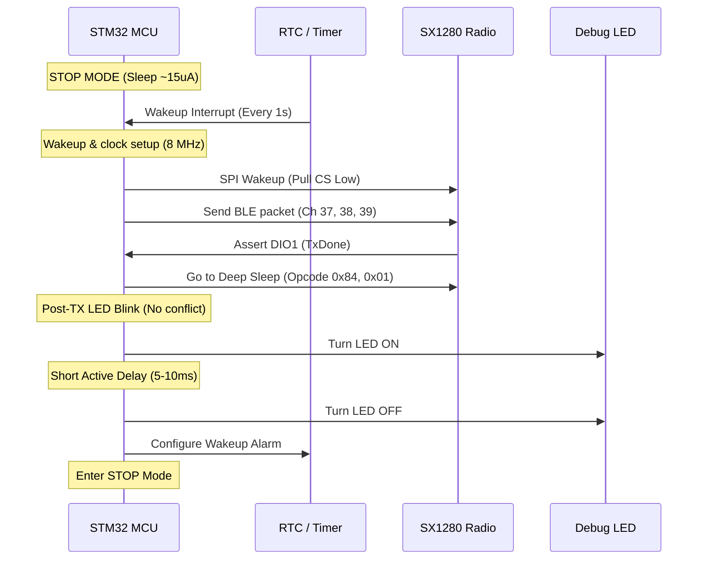

# CR2032 Power Optimisation: Open Questions & Solutions

This document answers core questions regarding running the STM32 + SX1280 BLE Beacon standalone on a **CR2032 coin cell battery**, detailing practical solutions for power reduction, clock management, sleep states, and hardware timing.

---

## 1. CR2032 Battery Power Capability

### ❓ Question
**Will the CR2032 battery be able to power the current transmission (advertising packets in the 3 channels)?**

### 💡 Answer
**No, not in the current firmware state.** Without hardware changes and power-saving software routines, the system will crash/reset repeatedly due to brown-out.

### 🔬 Technical Explanation
* **CR2032 Limitations:** A standard CR2032 battery has a capacity of ~220 mAh but a very high internal resistance ($10\ \Omega$ to $30\ \Omega$ when fresh, quickly rising to over $100\ \Omega$ as it discharges). It is rated for continuous currents of **$< 1 \text{ mA}$** and pulse currents of at most **$10\text{ mA}$ to $15\text{ mA}$**.
* **Current Peak Draw:**
  * **STM32F103 (Active at 72 MHz):** ~30–40 mA.
  * **SX1280 (TX at +13 dBm):** ~24 mA.
  * **LED (PC13 Active):** ~2–5 mA.
  * **Total Peak Draw:** **$55\text{ mA}$ to $70\text{ mA}$**.
* **Voltage Collapse:** When drawing 60 mA from a CR2032 with a $15\ \Omega$ internal resistance:
  $$V_{\text{drop}} = I \times R = 0.060 \text{ A} \times 15\ \Omega = 0.9 \text{ V}$$
  The battery voltage will instantly drop from $3.0\text{ V}$ to $2.1\text{ V}$. If the battery is slightly discharged, the voltage drops below the **$2.0\text{ V}$ Brown-Out Reset (BOR)** threshold of the STM32, triggering a system reset.

### 🛠️ Solution
1. **Decoupling Buffer Capacitor:** Solder a large, low-ESR **$100\ \mu\text{F}$ to $220\ \mu\text{F}$ capacitor** (tantalum or ceramic) in parallel with the CR2032 battery holder. This capacitor acts as a reservoir, supplying the high-current pulses during the $10\text{ ms}$ transmission burst and recharging slowly from the battery during the idle period.
2. **Lower TX Power:** Set the SX1280 transmit power to **$0\text{ dBm}$** or **$-3\text{ dBm}$**. A $0\text{ dBm}$ transmission cuts the radio TX current to **$\approx 10\text{ mA}$**, which is much safer for a coin cell.

---

## 2. Low-Frequency Clock Configurations (8 MHz SYSCLK)

### ❓ Question
**How does changing the clock of APB2 peripherals affect this code and the transmission? (e.g. operating at 8 MHz)**

### 💡 Answer
Lowering the peripheral clock speed **reduces MCU active current dramatically** (down to $\approx 5\text{ mA}$) and **does not affect on-air RF parameters** (bitrate, frequency, and channel spacing remain correct). The only effect is a slightly slower SPI transfer speed.

### 🔬 Technical Explanation
* **On-Air Independence:** The BLE transmission parameters (such as the 2402 MHz carrier frequency, the 1 Mbps symbol rate, and the GFSK frequency deviation) are generated by the **SX1280's internal 52 MHz reference crystal**, not the STM32's system clock.
* **SPI Speed Change:** SPI1 resides on the APB2 bus.
  * At **72 MHz SYSCLK**, APB2 runs at 72 MHz. With a prescaler of 8, the SPI clock is **$9\text{ MHz}$**.
  * At **8 MHz SYSCLK** (bypassing the PLL and running directly off the HSE crystal), APB2 runs at 8 MHz. With a prescaler of 2, the SPI clock is **$4\text{ MHz}$**.
* **Timing Overhead:** Writing the 38-byte PDU to the buffer:
  * At 9 MHz SPI: $\approx 34\ \mu\text{s}$.
  * At 4 MHz SPI: $\approx 76\ \mu\text{s}$.
  This $42\ \mu\text{s}$ increase in active SPI transfer time is negligible and is outweighed by the massive active current savings of the MCU.

### 🛠️ Code Configurations
Modify `SystemClock_Config()` in `main.c` to disable the PLL and route the HSE clock directly:
```c
void SystemClock_Config(void)
{
  RCC_OscInitTypeDef RCC_OscInitStruct = {0};
  RCC_ClkInitTypeDef RCC_ClkInitStruct = {0};

  // Run directly off the 8 MHz HSE crystal, bypass PLL
  RCC_OscInitStruct.OscillatorType = RCC_OSCILLATORTYPE_HSE;
  RCC_OscInitStruct.HSEState = RCC_HSE_ON;
  RCC_OscInitStruct.PLL.PLLState = RCC_PLL_OFF; 
  if (HAL_RCC_OscConfig(&RCC_OscInitStruct) != HAL_OK) Error_Handler();

  RCC_ClkInitStruct.ClockType = RCC_CLOCKTYPE_HCLK | RCC_CLOCKTYPE_SYSCLK
                              | RCC_CLOCKTYPE_PCLK1 | RCC_CLOCKTYPE_PCLK2;
  RCC_ClkInitStruct.SYSCLKSource = RCC_SYSCLKSOURCE_HSE; // Use HSE as SYSCLK
  RCC_ClkInitStruct.AHBCLKDivider = RCC_SYSCLK_DIV1;     // 8 MHz
  RCC_ClkInitStruct.APB1CLKDivider = RCC_HCLK_DIV1;      // 8 MHz
  RCC_ClkInitStruct.APB2CLKDivider = RCC_HCLK_DIV1;      // 8 MHz
  if (HAL_RCC_ClockConfig(&RCC_ClkInitStruct, FLASH_LATENCY_0) != HAL_OK) Error_Handler();
}
```

---

## 3. Power Minimization Strategies (STM32 & SX1280)

### ❓ Question
**Genuine options of trying to minimise power consumption of STM32 and sx1280 without affecting the transmission.**

### 🛠️ Hardware & Software Solutions

#### A. Semtech SX1280 Optimisations
1. **Enable DC-DC Regulator Mode:** 
   The current code initializes the radio in LDO mode. Switching to DC-DC regulator mode cuts the RX and TX currents by nearly **50%**.
   * *Code change:* Send command `SetRegulatorMode` (opcode `0x96`, payload `0x01` for DC-DC) during initialization.
2. **Utilize Deep Sleep Mode (with retention):**
   Between transmissions, the SX1280 should be put into sleep mode (opcode `0x84`, payload `0x01` to retain register configurations in standby RAM). 
   * Standby RC current: **$1.3\text{ mA}$**
   * Sleep mode current: **$< 1\ \mu\text{A}$**
3. **Calibrate TX Power:**
   Reduce the TX output power to **`0 dBm`** (payload `0x12` in `SetTxParams`). This drops the transmit current from **$24\text{ mA}$ to $10\text{ mA}$** while still providing a robust indoor signal.

#### B. STM32F103 Optimisations
1. **Disable Unused GPIO Port Clocks:** 
   Disable clocks for unused ports (e.g., GPIOD) to eliminate leakage current.
2. **Configure Unused Pins as Analog Inputs:**
   Floating input pins cause internal CMOS gate oscillations, consuming power. Configure all unused MCU pins as **Analog Input with No Pull** to minimize leakage.
3. **SPI Interface Shutdown:**
   Disable the SPI peripheral (`__HAL_SPI_DISABLE(&hspi1)`) and pull the SPI pins (SCK, MOSI, NSS) LOW when entering sleep mode to prevent current from leaking into the SX1280's input pins.

---

## 4. Sleep Scheduling & Low-Power LED Control

### ❓ Question
**The battery cannot drive the process in continuous mode, so we have to let the processor sleep. When do we do that? Options for making SX1280 go to sleep. Options of not delaying the LED to turn on without delay like <10ms.**

### 🛠️ Implementation Strategy



#### A. Waking Up and Going to Sleep
* **When to Sleep:** The active transmission cycle takes under $10\text{ ms}$. The remaining $990\text{ ms}$ of the 1-second interval must be spent in deep sleep.
* **STM32 Stop Mode:** Put the STM32 into **Stop Mode** (with voltage regulator in low-power mode) to reduce current to **$\approx 15\ \mu\text{A}$**. Use the Real-Time Clock (RTC) or a low-power timer to generate a wakeup event every $1\text{ second}$.
* **SX1280 Sleep Command:** Put the radio to sleep right after the last channel transmission:
  ```c
  // SetSleep opcode (0x84) + retention config (0x01)
  uint8_t cmd_sleep[2] = {0x84, 0x01}; 
  SX1280_SendCommand(cmd_sleep, 2);
  ```
* **SX1280 Wakeup Trigger:** Pull the SPI `NSS` line (`PA4`) LOW to wake up the radio. Wait for the `BUSY` pin to go LOW before executing the next command.

#### B. LED Blinking without Delay Conflict (Non-overlapping)
* **The Problem:** Turning on an LED draws $3\text{ mA}$. If the LED is turned on *during* transmission, the current adds to the peak draw, risking a voltage drop.
* **The Solution (Post-TX Flash):**
  1. Complete the transmission on all 3 channels.
  2. Put the SX1280 into Sleep mode. (Radio current is now $< 1\ \mu\text{A}$).
  3. Turn the LED ON.
  4. Perform a small, non-blocking delay of **$5\text{ to } 10\text{ ms}$** (visible to the human eye).
  5. Turn the LED OFF.
  6. Place the STM32 into Stop Mode.
  
This ensures that the LED current and the Radio transmission current **never overlap**, preventing battery voltage collapse.
